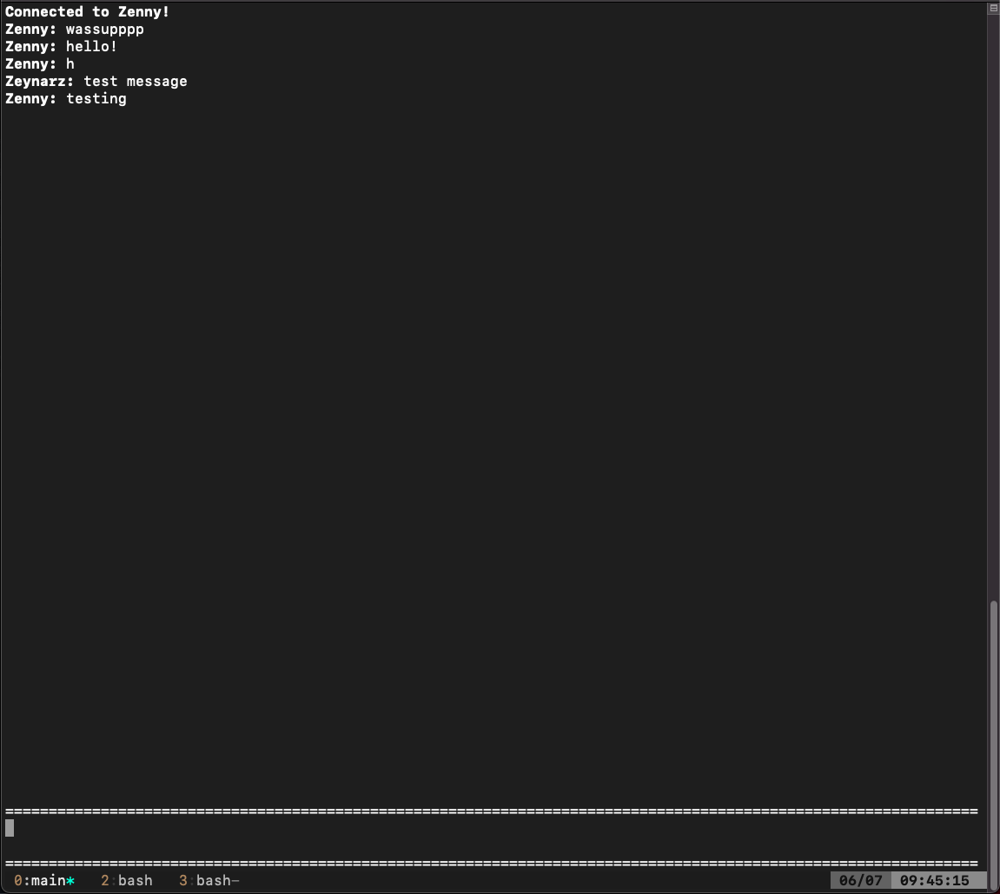

# AES Messenger
## Description   
Send and receive messages instantly over the internet to another computer. All of the messages sent are encrypted with AES(Advanced Encryption Standard) using your own 16 byte keys. Even if someone managed to steal your packets over the network, they wont be able to see your messages since they need your key to decrypt it. The server you are connecting to needs to have matching keys in order to talk to each other, the program will end the connection as soon as it finds out that you don't have matching keys.  
**Note**: If you find any memory corruption vulnerabilities, please contact me immediately. (Contact information below)

## Requirements
- git
- gcc
- libsodium (https://libsodium.gitbook.io/doc/)

## Compatibility
Currently compatible with linux and macos.
Tried to run the code on windows but ran into a lot of problems installing libsodium
It would probably take a lot of work to run this on windows since I used a lot of unix libraries (for example sys/socket.h)

## Installation
Copy and paste the following commands in a bash shell
```
git clone https://github.com/Zeynarz/aesMessenger.git
cd aesMessenger/
gcc main.c -o main -lm -lsodium -lncurses -lpthread
```
One liner
```
git clone https://github.com/Zeynarz/aesMessenger.git; cd aesMessenger/;gcc main.c -o main -lm -lsodium -lncurses -lpthread
```

## Usage
Once you executed the program by typing ```./main``` , you will get the following menu
```
1: Start server
2: Connect server
3: Insert key
4: Insert username
5: Generate random key
6: Exit
Select:
```
**Set the key used for encryption/decryption and set your username before doing anything else.**  
If you can't think of a secure key, select the generate random key option.  

In order to talk to each other, one has to start a server while the other one has to connect.

### Starting a server
1. Setup port forwarding to a specific port (Example forum on how to setup port forwarding on a tp link router https://community.tpg.com.au/t5/Modems-and-Devices/Port-Forwarding-on-the-TP-Link-VR1600V/td-p/1814)   
2. Choose Start Server in the program and enter the port you wish to open the server on (use the internal port number you set in port forwarding)

### Connecting a Server
1. Choose Connect Server in the program and type in the public ip address of the server and the port of the server

**Note**: To leave a conversation , type ```/leave```

## Screenshots

This is what the chat looks like

  
This is what the data layer of the packet (that holds "test message") looks like !  


## Contact
Discord: Zeynarz#8600  

### Extra
Got quite comfortable with C after working on this project and learned a lot about Aes. Learned some stuff about port forwarding and actually putting a server on the internet. Got to do network programming for the first time too so that was quite fun. Doing this project was overall a lot of fun.

### helpful sources:      
https://www.youtube.com/watch?v=gP4PqVGudtg (Aes encryption process)   
https://www.youtube.com/watch?v=9TYfiO__m2A (Galois Fields)   
https://en.wikipedia.org/wiki/Finite_field_arithmetic (Galois Field Multiplication)   
https://crypto.stackexchange.com/questions/9974/multiplication-division-in-galois-field-28 (Gf Multiplication)    
https://slideplayer.com/slide/250044/1/images/32/AES+Algorithm+-+MixColumns.jpg (good MixColumn picture)      
https://www.angelfire.com/biz7/atleast/mix_columns.pdf (detailed information about MixColumns)      
https://captanu.files.wordpress.com/2015/04/aes_sbox.jpg (subBytes table)    
https://www.codeproject.com/Articles/586000/Networking-and-Socket-Programming-Tutorial-in-C (networking in C)    
